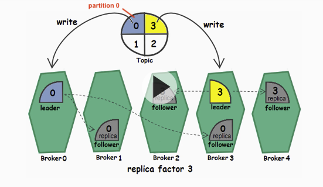
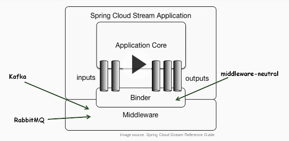
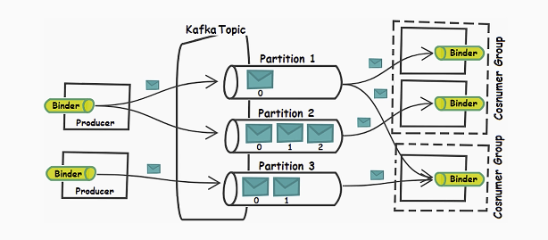
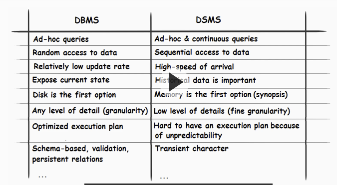
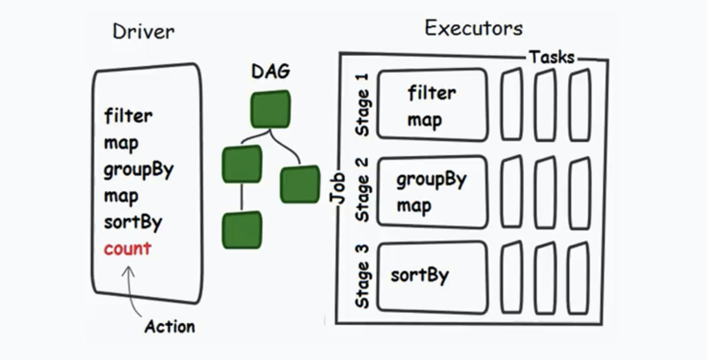
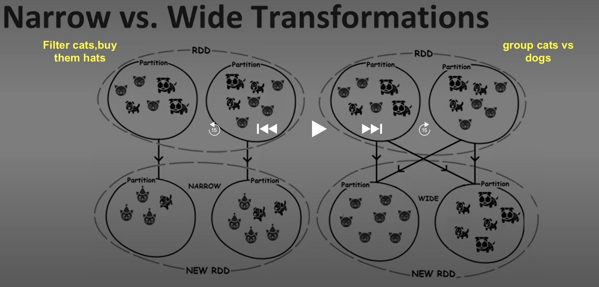
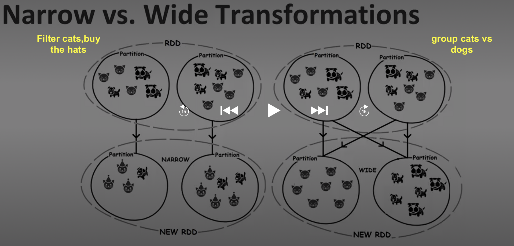
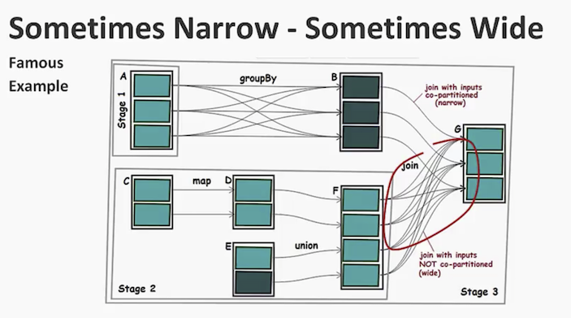
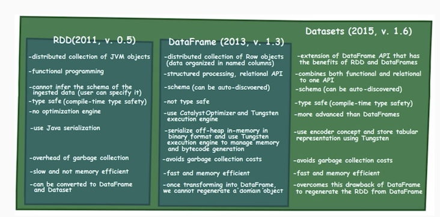
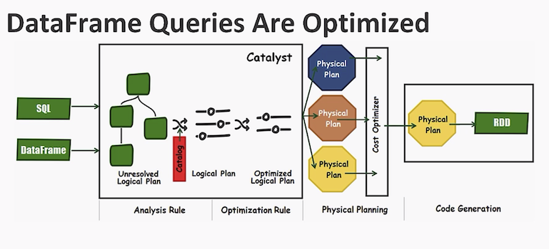

# Data Stream Development with Apache Spark, Kafka, and Spring Boot

author: Anghel Leonard
length: 8 hrs

NB: has included images , make a preview

course code:
https://github.com/PacktPublishing/-Data-Stream-Development-with-Apache-Spark-Kafka-and-Spring-Boot


wiki page to map clips to  source code
https://github.com/PacktPublishing/-Data-Stream-Development-with-Apache-Spark-Kafka-and-Spring-Boot/wiki/Source-code


szi  ij project setup with modules gradually imported
`cloud/spark/dstream_dev_spark_kafka_springboot/szi/ijparent`


## Plan
* ch1 Introducing Data Streaming Arch
* ch2 Deployment of Collection and Message Queuing Tiers
* ch3 Proceeding to the Data Access Tier
* ch4 Implementing the Analysis Tier
* ch5 Mitigate Data Loss between Collection, Analysis and Message Queing tiers


## ch1 Introducing Data Streaming Arch

### Overview

stream of meetup website rsvp using SpringBoot websocket connect

mongo db for storage

spark for analytics 


Data streaming to be learned in bricks

we can have have:
* hard real-time systems
    * response withing microseconds, milliseconds
    * such systems must be robust .e.g flight controller 
* soft real-time systems
    * milleseconds to seconds range
    * missed event is not catastrophic
* near real-time systems
    * seconds, minutes range


#### Course sol arch blueprint

```
                                                    |in-memory storage|    
                                                        |              \ 
| sources | -> |collection| -> |message queuing| -> |analysis|            |data access| 
                                                        |              /        | 
                                                    |long-term storage|         |    
                                                                            |clients|
```

* collection   : Spring-Boot based app  to get data via Spring WebSocket API
    * alternatives for spring-boot are Netty, Grizzly NIO, Apache MINA
* message queuing : apache Kafka
    * alternatives activeMQ, RabbitMQ
* analysis tier : Apache Spark
    * alternatives: Samza, Apache Storm, Apache Flink
* storage tier : mongoDB 
    * alternatives: a lot: Cassandra, MySQL, RocksDB
* data access tier: mongoDB exposed via Spring Boot app
    * server-sent events endpoint done with Spring Reactive API
    * alternatives: RxJava, Datamil

questions to ask:
* how fast need to ingest data
* what protocol is supported
* how much of it should be buffered before it is analyzed
* how much results you need to store
* do you need fast-writes
* do you push thee results again in the pipeline
* what type of analysis you will do
* what throughput and latency is needed
* how you expose the results to the clients


####  Meetup RSVPs  use-case
www.meetup.com

rsvp is a response for 'please respond'
access the stream via   https://stream.meetup.com/2/rsvps

1 single rsvp json
```json
{
  "venue": {
    "venue_name": "Hillside Public Library",
    "lon": -73.68822,
    "lat": 40.73446,
    "venue_id": 26457015
  },
  "visibility": "public",
  "response": "yes",
  "guests": 0,
  "member": {
    "member_id": 294510807,
    "photo": "https://secure.meetupstatic.com/photos/member/1/4/7/thumb_293760327.jpeg",
    "member_name": "Susan Weber-Fishkin"
  },
  "rsvp_id": 1828853892,
  "mtime": 1581546491000,
  "event": {
    "event_name": "Job Search Meeting",
    "event_id": "268433892",
    "time": 1582054200000,
    "event_url": "https://www.meetup.com/jobwhisperer/events/268433892/"
  },
  "group": {
    "group_topics": [
      {
        "urlkey": "newcareer",
        "topic_name": "New Career"
      },
      {
        "urlkey": "career-network",
        "topic_name": "Career Network"
      },
      {
        "urlkey": "unemployment-support",
        "topic_name": "Unemployment Support"
      },
      {
        "urlkey": "career-executive-placement-job-search-resume",
        "topic_name": "Career, executive, placement, job search, resume"
      },
      {
        "urlkey": "networking-for-job-seekers",
        "topic_name": "Networking for Job Seekers"
      },
      {
        "urlkey": "problem-solving-for-job-hunters",
        "topic_name": "Problem Solving for Job Hunters"
      },
      {
        "urlkey": "job-search",
        "topic_name": "Job Search"
      },
      {
        "urlkey": "finding-a-new-job",
        "topic_name": "Finding a New Job"
      },
      {
        "urlkey": "resume-help-job-search-workshop-interview-help",
        "topic_name": "Resume Help, Job Search Workshop, Interview Help"
      },
      {
        "urlkey": "professional-job-search",
        "topic_name": "Professional Job Search"
      }
    ],
    "group_city": "New Hyde Park",
    "group_country": "us",
    "group_id": 18214905,
    "group_name": "The Job Whisperer (Formerly LI-SENG)",
    "group_lon": -73.68,
    "group_urlname": "jobwhisperer",
    "group_state": "NY",
    "group_lat": 40.74
  }
}
```

## ch2 Deployment of Collection and Message Queuing Tiers

Collection Tier is needed for bringing data into our pipeline

This will be an application capable to communicate with the source of data
* we will write a spring-boot app
* ingestion processes should be as fast as possible

#### patterns 
* request response pattern 
    * synchronous pattern
    * accepted only if delays are acceptable
    * adv: very easy to implement
* half-async pattern
    * asyncronous requests
    * supported by frameworks Netty, Play, Nodejs
* request acknowledge pattern
    * the request does not expects a response but an ack. 
        * can be used for hearbeats
* publish-subscribe pattern
    * very used in message based systems eg apache-kafka
* fire-and-forget-message pattern
    * when a system can trigger a request without expecting a response
    * sensors sending lots of data. it's ok to miss few events
* stream pattern
    * collection tier triggers a single request to the data streaming API
        * this makes a persistent connection to the data streaming API
        * data is consumed as a stream, response is a continuously flow of data    

We will connect to the Meetup RSVP WebSocket API, and we will start ingesting data via a persistent connection.

#### protocols
* Webhooks
    * register callbacks or endpoints that will be notified for changes
    * not ok for hight throughput
* HTTP long polling
    * keeps http request open until some data is returned
    * refires immediately next request
* server-sent events protocol
    * improvemnt over http long polling protocol
    * support higher rate of updates that long polling
* server-sent events push proxy
    * variation of server-sent events
* WebSocket protocol
    * full duplex protocol that uses TP
    * uses HTTP for handshake, then switches to TCP
    * has low latency, supports high throughput
    * !! one of most used protocols for streaming        

### web socket api overview
* bidirect comms
*  http for handshake and tcp for transport
* uses port 80/443 and urls  ws://  or wss://
* all desktop and mobile browsers support it
* 1st is handshake -> connection persistennt open
    * bidirectional messages
    * both sides can close conn <-> close handshake
* websocket is just on of the protocols


Spring has WebSocket client

spring supports STOMP wub-protocol  (nb!: out of scope)

Spring has StandardWebSocketClient (we will use it), JettyWebSocketClent, SockJsClient.

* We will use Steram Pattern
* our meetup RSVP  endpoint is availabe at ws://stream.meetup.com/2/rsvps
* push only
* use Spring WebSocketClient API via a spring Boot application

we will write RsvpWebSocketHandler class

####  demo project CollectionTier/CollectRsvpsAndDisplayOnScreen/
import module in ijproject

`com.rsvps.RsvpApplication` is a standard springboot app
`com.rsvps.RsvpsWebSocketHandler`  prints messages to the console

when app launched it receives json messages in the console

### why message tier is needed

* not a good idea to connect collection tier to analysis tier
* in distributed architecture we need weak coupling
* so collection tier needs to send messages to messaging tier. Tiers are communicting by  messages 
* backpressure problem: when analysis tier processes data slower than incoming data rate.
    * this can lead to data loss
* data durability issue
    * if analysis tier down, data is stored in message queueing. Untill a consumer becomes avaiable.  by defult kafka keeps messages for 7 days
* data delivery semantics
    * data can be lost forevor (read-at-most-once)   
    * data is never lost buy it may be reread (read-at-least-once) 
    * data is never lost and is read only once (read-exactly-once)

### introducing message queuing tier apache kafka

Messaging models:
* Point to Point Messaging (Queue)
    * sender - queue - single receiver or consumer
* publish - subscribe:
    * sender - topic - n receivers or subscribed consumers

#### kafka overview

developed initially by Linkedin

* distributed real-time, persistent messaging and fault tolerant system
* to form a cluster, Kfkal relies on Apache Zookeeper
* supports queue and topic semantics (topologies)


Topology

* messages are sent and read from topics
* a topic can contain one or more partitions (totally-ordered commit logs)
* each msg within a partition has an identifier called: **offset**
* consumers can be organized in consumer groups and subscrbed to 1 or n topics
    * Each consumer from the group reads from a unique partition
    * if more consumers than partitions, some consumers will be useless (more later)
    * Each broker holds a number of partitions
    * each of these partitions can be a leader, a follower or a replica for a topic

offsets

* zookeper updates offsets, from v 0.9  brokers can direcly receive offset updates
* consumers commit offset updates into a special topic named Consumer_offsets

Topics - Partitions

* topics handle multiple data streams
* producers publish messages via push
* consumers consume messages via pull
* a producer can publish in multiple  topics
* a consumer can read from multiple topics

Partitions

* each kafka topic contains 1 or n totally-ordered commit logs called partitions
* each msg in a partition is identified by an offset
* by default Kafka will not delete a message after consummation. So it can be reread
* a consumer can read messages from multiple partitions. But order is guaranted only within a partition
* Kafka works in append-only mode, ie new messages can only be appended
* producers doesn't explicitly specify or compute the offset value. Kafka does it
* Consumers start to consume messages from a last commited offset NB!  or from a specified offset
* Consumers can rely on kafka to committing offsets
* In case of a failure, the committed offset will act as the recover point

Partition Replication

*  each partition is stored on a broker
*  a partition be replicated for fault tolerance via a config parm: `replication factor`
* one can say that partition is the unit of replication for the topic
* we can scale the system by adding more partitions
* every partition has a **leader broker** which handls all read-write requests
* over brokers has a replicated partition
  * new message is appended  to the partition on  a leader broker
  * each follower broker reads the message and updates its own log
  * when all followers are in sync, known as the in sync replicas, the message can be sent to the consumers
* in case of failure a new leader broker is chosen NB!
* when a follower rejoins after a downtime, it can re-sync



diag example 4 partitions, replication factor is 3
  * each of 4 partitions has a distinct leader broker
  * each of 4 partitions has also 2 replica brokers


* arch design k-fault tolerant systems
* for a replication factor n kafka tolerates n-1 broker failures without losing any commited messages

producers push messages

for a message:
* a partition is selected by robin-round algo
* or via semantic partitioning based on a key in the message
  * msgs with specific keys are routed to a specific partition
  * potential imbalanced fills of parittions
  * we can provide our won partition implementation with a more business specific partitioning function

consumers pull messages

* each consumer maintains an offset of the messags it has already consumed
* this offset can be incremented automatically or manually.
* NB! consumed messages are not deleted from Kafka. but kept for a  **retention period** (dflt 7 days)
* retention period is configurable per topc or for all topics

Consumer rebalancing 

* if a consumer goes down,  kafka rebalances remaining consumers in order to continue consume
 messages from all partitions
* when a consumer comes back, kafka rebalances consumers to the initial state


Consumer groups

* a consumer group can group consumers in groups identified by unique names in cluster
* consumers from a group read messages like from a queue topology
* each partition can be consumed only by one consumer within the consumer group
* group provide isolation to topics and partitions
* common patterns of isolation:
  * all consumers intances in one group
  * all consumer instances in different group
  * many consumer instances in a group

* consumers can consume multiple partitions ( consumer 0 reads from partition 0,1)
* consumers can consume from one partition (consumer 0 reads from partition 0 )
* if  n consumers > n partitions, some consumers do not see a single message

Delivery semantics

* kafka garantees at leas once delivery sematnics
* kafka also supports at-most-once and exactl-once semantic
* exactly-once delivery is the most hard to achieve
  * article:  https://www.confluent.io/blog/exactly-once-semantics-are-possible-heres-how-apache-kafka-does-it/

Kafka durability

* capacity that the messages that have been committed will not be lost
* compromise on throughput
* achieved via replication
* a producer can wait for a configurable ack that current message is arrived in kafka
* levels of durability
  * low durability: fastest, no acks  (config ack=0)
  * medium durability: 1 ack from leader replica, (config ack=1)
  * high : acks from all replicas  (config ack=-1)
  * throughput can be scaled by increasing number of brokers

example of a sane configuration (high durability)

* replication : 2
* min.insync.replicas 2
* requst.required.acks -1 


Recommending books:
* packt Learning Apache Kafka,
* packt Building Data Streaming Applications with Apache Kafka


#### demo kafka install and configure


1. outdated zookeeper and kafka as separate downloads 
* zookeeper   https://www.apache.org/dyn/closer.cgi/zookeeper

2. currenty  http://kafka.apache.org/downloads

already installed in `/opt/sft/kafka_2.12-2.3.0/`
with data dir configured to be `~/sdata/kfd`

kafka configs
```
config/zookeper.properties
config/server.properties
```

start kafka
```
cd /opt/sft/kafka_2.12-2.3.0

#start  zookeeper  daemon process  (starts on port 2181)  must ran always
bin/zookeeper-server-start.sh /opt/sft/kafka_2.12-2.3.0/config/zookeeper.properties

#start  kafka server daemon process
bin/kafka-server-start.sh /opt/sft/kafka_2.12-2.3.0/config/server.properties

```

the data dir under kfd  start to get filled with files 


start zookeeper `bin/zookeper-server-start.sh`

### Running the collection tier
We will cover spring cloud stream, source, processor, sink, message binders, apache kafka binder, sprint cloud stream in collection tier, demo sending the collecting data to message queuing with a written kafka producer

connect collection tier to queuing tier

##### spring cloud stream overview
* built on 2 frameworks, spring boot and spring integration
* simplifies the writing of event/message drive applications
* supports common primitives in messages 
* provides a binder API (messaging middleware bindings)
* binder API responsible to connect **source**, **processor**  and **sink** channels to the middleware layer
* easy and intuitive programming model
* springBoot application extends spring cloud stream application
* binder connect spring-boot app to a middleware (kafka or rabbitMQ ..)




* source: output channel
* sink: input channel
* Processor: sits between intput and output channels

message Binders

* @EnableBinding annotation  turns spring app to spring cloud stream app
* take as params 1 or more interface classes that contain methods
* eg @EnableBinding(Source.class)
* springCloudStream  prod: bindings {kafka, rabbitMQ} experimental: {JMS, Pub/Sub}
* configurable in application.properties `spring.cloud.stream.kafka.binder.brokers`
* there are dedicated configurations for producers and consumers

Producers are instances of SpringCloudApp ref diagram below:



#### demo module CollectionTier/CollectRsvpsAndSendToKafka


* spring Cloud stream publishes a collected data in kafka topic named `meetupTopic`
* use cmdl kafka consumer in order to test the Collection Tier

* check `src/main/resources.application.properties` where a topic is configured
* a single broker is configured at localhost:9092
* a topic name is configured with a single partition
* content-type for message is set to text/plain

go to kafka command line, and create topic

```
kafka-topics.sh --bootstrap-server localhost:9092 --list

kafka-topics.sh --bootstrap-server localhost:9092 --topic meetupTopic --create --partitions 1 --replication-factor 1

kafka-topics.sh --bootstrap-server localhost:9092 --list

kafka-topics.sh --bootstrap-server localhost:9092 --topic meetupTopic --describe

```

to start consuming message in cli consumer listening `meetupTopic` topic
```
kafka-console-consumer.sh --bootstrap-server localhost:9092 --topic meetupTopic
```

and start the SpringBoot App in the module  CollectRsvpsAndSendToKafka  and we observe messages in the kafka cmdLine consumer

if you stop the consumer but not the springbootApp. messages will be stored in the topic.

to get the latest/largest offset of messages in the topic
```
kafka-run-class.sh kafka.tools.GetOffsetShell \
-broker-list localhost:9092 --topic meetupTopic  --time -1
```

to get the earliest/smallest offset of messages still in the topic
```
kafka-run-class.sh kafka.tools.GetOffsetShell \
-broker-list localhost:9092 --topic meetupTopic  --time -2 
```

to (re)consume all messages in topic
```
kafka-console-consumer.sh --bootstrap-server localhost:9092 --topic meetupTopic --from-beginning
```

to purge messages in topic you need to change retention.ms config to 1 sec and then change it back to 24 hrs 86400000

```
bin/kafka-configs.sh --zookeeper localhost:2181 \
--alter --entity-type topics --entity-name meetupTopic --add-config retention.ms=1000

## wait for 1 min then set rentetion back to 24 hrs

bin/kafka-configs.sh --zookeeper localhost:2181 \
--alter --entity-type topics --entity-name meetupTopic --add-config retention.ms=86400000

```

NB! also put in kafka_home/cnfig/consumer.properties
`auto.offset.reset=latest`

Now the latest and earliest message should have the same offset


## ch3 proceeding to the data access tier

storage for
* just discard it
* reanalyze it
* store data in memory for fast access and real-time usage (in-memory storage)
* store data for long time for offline access or batches usage


nowdays many options for long-term storage
* hdfs
* s3
* rdbms
* glacier
* kafka kinesis
* nosql


query by timestamp
* cassandra
* mongodb


Storing data in memory
* sqlite
* h2
* rocksDb
* HSQL
* DerbyDB
* LMDB


Caching strategies
* Read Through
* Cache aside
* Write Through
* Write Back
* Write Around

Caching systems
* Hazelcast
* Memcached
* Redis
* DynaCache
* EHCache
* OSCache

in-memory databases IMDBs, in-memory data grids IMDGs

IMDBS,IMDGs
* Hazelcast
* Apache Geode
* Infispan
* Couchbase
* Aerospike
* Apache Ignite

Static & Dynamic Filtering

#### introduction to mongoDB

* mongoDB is NoSQL
* open-source high-perf document oriented DB
* CAP Theorem : Consistency , Partition Tolerance, Availability

why good for us:
* schema-less (flexible data model)
* high-throughput and horizontally scalable
* flexible/rich querying
* powerful indexing (primary, secondary, index intersect)
* high-availability and fault tolerance via replication (replica sets)
* Active community and commercial support

* good RDBMS replacement for web apps (not transactional)
* real-time analytics
* high-speed logging and caching
* semi-structured content management
* high-scalability
* mobile apps and IoT
* No downtime tolerated

mongodb is bad for:
* highly transactions aps
* complex SQL
* search engine (not competing with Solr or Elasticsearch)
* data warehouse (not competing with Vertica or Teradata)

mongodb Terminology
* mongoDB contains collections in place of tables
* collections are schdema-less
* a document for a collection is a row/record for RDBMS
* RDBMS column = mongoDB field
* document can have a primary_key
* documents stored in BSON (binary JSON)
* mongodb supports embedded or references (FK in rdbms) relationships
* mongodb has hard key (partition key in rdbms)

Capped collections
* fixed size collecton acting as a ring buffer data structure
* preserve insertion order , does not allow updates
* when limit is reachded, old documents are automatically removed
* allows use of tailable cursor to retrieve documents

Deployment and scaling
* replica sets
* primary node do all write-reads, 
* data repicated to secondary nodes
* for scaling sharding: several primary nodes with its replicas

download & install mongodb
Consider the below link for downloading MongoDB and MongoCompass kit:
https://www.mongodb.com/download-center/community

downloaded mongodb-macos-x86_64-4.2.3.tgz, untarred into /opt/sft/mongodb-macos-x86_64-4.2.3

added to .bash_profile the mongodb bin to $PATH

create dirs
```
mkdir /usr/local/var/mongodb
mkdir /usr/local/var/log/mongodb
```
Run mongod with command-line parameters

created a shell script `bin/mongod_run.sh`

osx preferences security and privacy general  click 'allow anyway' button

run and verify mongod process
```
>bin/mongod_run.sh
>ps aux | grep -v grep | grep mongod
>mongo #to start using
#install compass by
bin/install_compass
```

connect to db using compass or robo3t  using localhost:27017

create a databases  meetupDB with a collection rsvps capped with size 102400 bytes

recommended book: packt mastering mongodb 3.x

### exploring spring reactive

plan
* what is reactive programming
* reactive manifesto
* asynchronous apps
* publisher subscriber backpressure
* reactive streams
* spring reactor and spring wefFlux
* spring reactive repositories
* tied up mongodb and spring reactive


reactive programming is a paradigm
* has idea of mutable state
* only care about the order in which the things need to happen
* react to events instead of relying on a call stack
* truly useful in the asynchronous and non-blocking backpressure contexts

Reactive Manifesto
* react to events
* react to load
* react to failures
* react to users

Asynchronous apps can be painful if incoming data is high rate 

combineLatest() operator

publish-subscriber backpressure
* Project Reactor
  * Mono API & Flux API
  * reactive library focused on server-side Java 
  * based on Reactive-Streams specifications, all of is ops support non-blocking backpressure
  * Reactor operators: many.. including combineLatest(), switchMap()
  * Mono API transforms single item.  item passes from 1 or n operators
  * Flux API transforms n items

Spring WebFlux
* dedicated to join Web and reactiv worlds. 
* added in spring 5
* runs on Netty and Tomcat
* requires Reactor as core dependency
* comes with 2 programming models
  * annotated cntrollers (compatible with spring MVC)
  * functional endpoints (lambda-based, ightweight, functional model)

Spring Reactive Repositories
* MongoDB, Cassandra and Redis provie reactive data access support
* Spring Data has been enriched with reactive support
* reacive repositories use project reactor types
* built on top of Reactive template eg `ReactiveMongoTemplate`

book recommended:
packt: Reactive Programming in Spring 5.0


#### exposing the data access tier in browser

plan:
* espose a reactive stream endpoint via SSE(HTTP) (server-side events)
* connect clients to our stream
* show data via google maps
* implement the client of our stream
* communication patterns

HTML 5 SSE

#### demo MongoDBReactiveClientSSE

When com.app.Application is started  the static/index.html is exposed at `http://loacalhost:8080`
with google maps. 

if correct json file is inserted in mongodb, the rsvp location is inserted on the google map


Communications patterns
* Publish-Subscribe Pattern
* RmI/RPC pattern (remote moethod invocation)
* Simple Messaging Pattern
* Data Sync Pattern


## ch4 Implementing the Analysis Tier

#### diving into the analysis tier


#### streaming algorithms for data analysis


Stream Mining
* via sql-like queries + math operations allow as to process endless data

Data Streams
* potentially infinite
* many contain high amount of data
* may have high speed of arrival
* a processed element is discarded or archived


Bot types of queries always supported  (sql-like  and programmatic)
* all major stream-processing frameworks support both
* ad-hoc queries
* continuous queeries (asked all times)

Quering DBMS vs DSMS 




Stream Mining Constraints
* single pass: each record is examined at most once (or archived)
* synopsis: virtually every streaming method uses som form of synopsis ? 
* bounded-storage: limited memory for storing synopsis
* real-time: record must be processed as fast as possible to maintain synopis
* approximate answer: streaming algos compute approximate answers (deterministic and probabilistic bounds)
* Concept Drift.  Desirability to detect it. When data's disribution changes a model most often will lower its predictive power. 


Load Shedding
* address the peaks of data (Load Shedding)
* helps dealing with peaks


Stream time and event concept
* stream time: when events enters a streaming sysytem
* same as processing time
* event time: time when event occurs


Trigger and eviction policies
* sliding : perid of fixed lenght delimited by time, any number of messages in it
* tumbling: period of variable lenght with a fixed number of events

Notorious Data Streams Algorithms

* Reservoir Sampling
* HyperLogLog(++) count distinct items in a stream (approximate)
* Count-Min Sketch: Frequency: how many times  has stream item X occured?
* Bloom Filter has item X ever occurred in a stram before? can produce false positive
  * can say for sure if an item X has never been seen before

summary:
* stream mining intro
* stream queries types
* stream mining constraints
* stream time and event time
* window of data
* notorious data streams algorithms


#### introducing our analysis tier - apache spark

plan:
* what is and why Spark
* terminology
* spark in big data ecosystem
* high-level architecture (execution flow)
* job architecture
* spark stack
* rdd and much more
* monitoring
* spark in analysis tier

spark is:
* open source fault-tolerant high-perf framework, general purpose distributed computing system
* processes big data
* one of the spark modules is **spark streaming**
* spark and subsequently spark streaming operate on batches of work

the good:
* spark is unified for data applications
* integration with hadoop but faster and more compact (less code to write)
* runs everywhere
* small and simple
* fits into the big data ecosystem
* process data in-memory
* multi-language APIs (java, scala, python, R)


terminology
* cluster manager: external service that mangaes ressoures in a cluster
* driver program: a process that starts the execution
* worker nodes: nodes in the cluste which perform distributed calculations
* executors: processes which transform data from memory/disk
* spark uses lazy evaluation paradigm to data transformations (map,filter) until an action is called
* each action is balled the driver program
* spark scheduler builds an execution graph (DAG) and launches a Spark job
* Each job consists of stages, which are steps in the transformation of the data
* taks: a unit of work sent to an executor

Spark in BigData Ecosystem
* spak is not a data storage: calculations are done in JVMs provisioned during calculations
* can be ran locally on single JVM (local mode; similates a cluster)
* supports 4 cluster managers: standalone cluster, apache mesos, hadoop yarn
* spark is used together with a distributed storage system (HDFS, Cassandra S3, MongoDB)
* **SparkContext** entry point for all spark applications
* spark applicaionis a set of spark jobs debined by one SpakContext
* SparkContext determines how many resources are allocated to each executor
* for JavaAPI we have a java-friendly JavaSparkContext
  * JavaSparkContext jsc = new JavaSparkContext(RUN_LOAL_WITH_AVAILABLE_CORES,APPLICATION_NAME);


high level architecture
* driver program : SparkContext  : a host
* Cluster Manger : 1 or n hosts
* Worker with Executors { Cache, {Task, Task,..}} :  n hosts

Spark Program Execution Flow
* Driver initiates a sparkContext and ask resources from the cluster Manager
  * spark programs depoyed here
* Cluster Manager (master) contacts Workers
* Workers spawn Executors JVMs
  * Transoformations and actions are executed on spark workders
  * Actions may transfer data from workers to the Driver or to HDFS

Spark Job Architecture


Spark Modules
* spark sql
* spark streaming
* MLlib (Spakr ML)
  * scalable 
* GraphX
  * API for graphs and graph parallel applications


RDD, Dataframes, Datasets
* Resilient Distributed Dataset
* most basic abstaction of data in Spark: like java collection **but** distibuted
* Dataframe API  higher-level of abstraction taht allows a quering language to query data
* DAtasets are an extension of DataFrame API

Checkpointing
* in case of failure, spark relies on rollback recover mechanism
*  spak relies on checkpoints to provide fault tolerance
* checkpoints comes in 2: reliable and local
  * metadata checkpointing: (configurations, stream operations, incomplete batches)
  * data checkpointing RDD to storage


Monitoring spark Jobs
* http://localhost:4040

book recommend: Apache Spark 2.x for Java Developers

#### plug-in spark analysis tier to our pipeline

* Executors connect to Driver Program

##### demo SparkKickoffEmpty
run the Sparkkickoff.main() which does not have a business logic to test if spark program executes ok


##### demo SparkKickoffWithKafkaUtilsAndMongoDBConnector
* kafka and spark-stream ddependencies added
  * park-streaming_2.11
  * spark-streaming-kafka-0-10_2.11
* add mongoDB spark connector  https://www.mongodb.com/products/spark-connector
  * mongoDB data is materialized as DAtaFrames, DataSes for analysis for ML, graph, steraming, SQL
  * mongodb string: uri:database:collection
  * add dependency org.mongodb.spark

#### brief overview of spark RDDs

RDD as a distributed collection
* RDDs are partitioned
  * number of parittions is not required to be equal with the number of worker nodes in cluster
* RDDs are hold in memory as much as possible but can be stored on disk
* RDDs have perf issues and cannot be optimized
* RDDs can be created from reading from S3, from streaming

Transformations and Actions
* Transformation are function running on Workers that return another RDD
* represent the logic and lazy
* contribute to execution platn (DAG),but they don't execute anything
* not optimized, applied in the order of occurence
* first rdd of a transformation is known as base RDD
* RDR cascade in a parent-child relationship
* funcs: most frequent {filter, flatMap, map, sortBy, groupBy}

ex:
```java
JavaRDD<String> rdds = jsc.parallelize(
                        Arrays.asList("This", "will", "become", "RDD")
);
JavaRDD<String> cools = rdds
                .filter(e -> e.contains("RDD"))
                .map(e -> e.concat("is cool"));                
```

Narrow vs Wide TRansformations
* narrow tranforms: {filter, flatMap, map, union, sample}
* narrow transforms can be executed on an arbitrary subset of data, indepenent from other subsets
* i.e. data is not moved between partitions

Wide transformations
* each partition of parent RDD used by multiple child partitions
* funcs { intersection, groupByKey, distinct, cartesian, sortByKey}
* data is moved between partitions on different nodes
* data shuffling is expensive (network io,disk io, data serialization)



##### demo  cloud/spark/sparkwithjava/szi/sparkTutorial project 

spark program 

`com.sparkTutorial.a_leonard.RddNarrowWideTx`

tt:10:26 half


groupByKey vs reducebyKey
* groupByKey will shuffle all the key-value pairs in all partitions
* reduceByKey combine all pairs inside a partition before shuffling the results between partitions
*  so reduceByKey performs much better on large datasets
*  check also combienByKey, foldByKey

Sometime Narrow somtimes wide
* eg `join` operation is wide, but it can act as narow if it comes after `groupByKey`
* show list of dependencies of an RDD via `dependencies()` method




Join co-partitioned narrow vs Join Not co-partitioned (wide)



Transformations
* force DAG execution
* actions that bring data results to the driver (expensive)
  * {reduce, collect, take, count, collectAsMap, takeSample}
  * collect one of most expensive. tries to bring all data to 1 machine, OutOfMemory
  * {collect, countbyKey, countByValue, collectAsMap} bring back **unbounded** output
    * avoid
  * {count, take, takeSample} return **bounded** output. Prefer them
* actions that write to storage
  * {saveAsTextfile, saveAsObjectFile, saveAshadoopFile}

RDD Memory Management
* persist RDD in-memory as deserialized java objects
* persist in-memory as serializd data
* persist on disk
* at RDD the LRU (least recently used) eviction policy is appiled

#### demo SparkKafkaToRDDToMongoDB

first start again ingestion messages to kafka
```
cd reporoot/CollectionTier/CollectRsvpsAndSendToKafka

mvn clean package

#start spring-boot app to ingest rsvps messages to kafka
java -jar target/CollectRsvpsAndSendToKafka-0.0.1.jar
```

then in AnalysisTier/SparkKafkaToRDDToMongoDB  run SparkRDD.main()
to consume kafka messages and store them in mongodb. 

check json documents in rsvps collection in Compass mongodb UI

tt: end 13:22

##### Spark Streaming

2 demos
* SparkKafkaToDStreamToMongoDB
* SparkKafkaToDStreamToMongoDBCountByWindow

plan:

* brief overview of spark streaming
* discretized streams (DStreams)
* the Receiver Thread
* Spark Streaming API
  * StreamingContext
* DStreams Transformations And Output Operations
* Kafka to DStream to MongoDB
* Spark Streaming Windowing
* Checkpointing


##### demo  AnalygticsTier.SparkKafkaToDStreamToMongoDB

prereq:
start springboot app
CollectionTier/CollectRsvpsAndSendToKafka

look through code  com.rsvps.StreamingRsvpsDStream

run com.rsvps.StreamingRsvpsDStream.main() in IJ

and run CollectionTier/CollectRsvpsAndSendToKafka springboot app
`java -jar target/CollectRsvpsAndSendToKafka-0.0.1.jar`


##### demo  AnalygticsTier.SparkKafkaToDStreamToMongoDBCountByWindow

study code `com.rsvps.StreamingRsvpsDStreamCountWindow`

this demo copies counts of messages into a new mongodb collection "meetupDB.rsvpscount"

it has params `WINDOW_LENGTH_MS=30000`, `SLIDING_INTERVAL_MS = 5000`


and run CollectionTier/CollectRsvpsAndSendToKafka springboot app
`java -jar target/CollectRsvpsAndSendToKafka-0.0.1.jar`

and run com.rsvps.StreamingRsvpsDStreamCountWindow.main()

then in mongodb observe in collection rsvpcount the counts of a sliding window every 5 seconds

#### Dataframes, Datasets and Spark SQL 
(22m)

1 demo
SparkKafkaToDatasetToMongoDB

SparkSession

RDD vs DataFrame vs Datasets




Catalyst optimizer for queieries




Dataset Encoders
* translate between JVM objecs (domain objects) and spark's internal binary format
* very advanced and much faster then java serializers


#### demo AnalysisTier.SparkKafkaToDatasetToMongoDB

run CollectionTier sprinboot app
run  SparkDataset.main()  from this module
in mongodb observer  docus in collection rsvpau

recommend book: packt Leaning Sparq SQL


#### Spark Structured Streaming
(32m)
1 demo
SparkKafkaToStructuredStreamingToConsole

Dataset/DataFrame API to express steraming aggregations, event-time windows, stream-to-batch joins etc

queries processed using a micro-batch processing engine
low-latency mode: Continuous Processing (1ms) !NB

structured streaming concept
* appending rows to unbounded dataFrame
 


#### 


  


