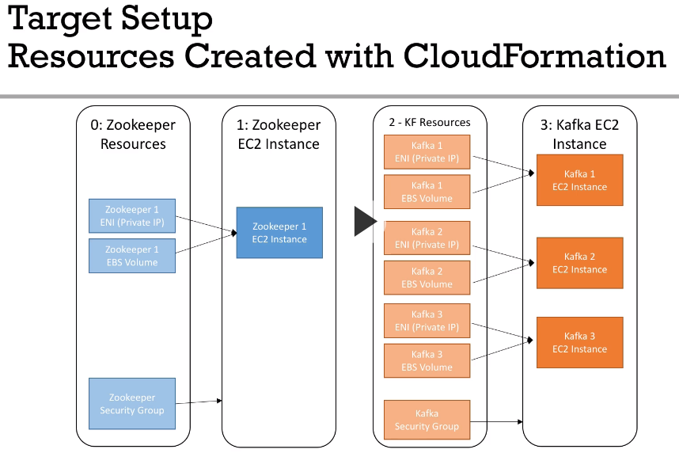

# Apache Kafka Series - Kafka Monitoring and Operations
auth: Stephanee Maarek
(5h)
Course Level: Expert
Audience:  kafka admins, architects, devops
code repo:
https://github.com/PacktPublishing/Apache-Kafka-Series---Kafka-Monitoring-and-Operations
(extract code under ref)

## Plan 
* ch1 Overview  (7m)
* ch2 kafka quick setup in aws (50 m)
* ch3 kafka admin setup (42 m)
* ch4 kafka monitoring setup : grafana + prometheus (78 min)
* ch5 kafka operations (120 min)
* ch6 kafka cluster upgrade (25 m)
* ch7 next steps (4m)

## ch1 Intro
Kafka on aws 5 ec2  instances 

### admin tools:
*  zooNavigator ui (for zookeeper)
*  yahoo kafka manager (for brokers)
* linkedin kafka monitor  (ui to visualize producer/consumer and measure end-to-end latency)

#### monitoring tools:
* prometheus: acquire + store metrics
* grafana: create dashboards to  viz metrics

#### Operations learning:
* roll restart of kafka brokers 
* update brokers conf in a safe way
* increase decrease replication factor
* add a broker to kafka cluster
* service and replace a broker in a kafka cluster
* remove a broker in a kafka cluster
* install CLI tools to automate workflows

## ch2 kafka quick setup
Setup kafka using  Cloud formation. 
Cloud formation is a declarative way to provision aws resources. 

### target infra
subnet AZ-A  , sbunet AZ-B  , subnet AZ-C in  3 availability zones
AZ-A (zookeeper + broker 1), AZ-B (broker2)  AZ-C(broker)

Zookeper
* Zoookeeper resources { ENI (private IP), EBS Volume, Security Group }
* Zooker EC2 Instance
* KF resources
* Kafka EC2 Instance

#### Cloud formation target setup
4 CloudFormation  templates


NB! kafka brokers run  version 1.1.1  .  later in the course  upgrade to 2.0.0

NB! serparate IP and EBS volumes from EC2 instances to be able to delete EC2 without using data or ip addresses

Setup SSH Keys in AWS 

#### deploy zoookeper using cloudformation
aws service cloud formation 

**create stack 0**
* upload template to amazon s3  : 0-zk-fixed-resources.yml
* for the default ip  172.31.9.21 select the matching  subnet 172.31.0.0/20  (VPC service )
	* the mask /20 is 255.255.240.0 and wildcard mask: 0.0.15.255
* hit next and create stack
* see events and resources as they are updated  

aws Ec2 service
* _security group_ for zookeper (refresh ec2 dashbaord: newrok and security)
* obseve ports  { 2888, 8080, 9999, 22, 3888, 8778, 2181}
* _network interface_ (for the  zookeeper ip  172.31.9.21)
* _elastic block Store Volume_   default volume of 8 gib

everything is in the expected frankfurt zone

**create stack 1**
file: 1-zookeeper.yml   this is for zookeeper ec2 instance creation 
* name zk-compute
* instance type t2.micro
*  for ec2 keyPair  first  create one in Ec2 console : Network : Key Pairs named KafkaMonitoringCourse   a pem ssh key file will be downloaded
* potentially disable rollback

**create stack 2**
file: 2-kafka-fixed-resources.yml
name: kafka-resources
* kafka1   in the same subnet as zookeeper entery ip 172.31.1.31
* google cidr to ip  to check available IPs for the given cidr mask such as 172.31.0.0/20
	* https://www.ipaddressguide.com/cidr
* kafka 2  create in  zone eu-central-1a  (this corresponds to subnet  172.31.16.0/20), give it ip addresse 172.31.17.32
* kafka 3 careate on zone eu-central-1b  (cidr: 172.31.32.0/20), give it ip 172.31.33.33
* kafka 4  let create = false,  put  IP : 172.31.1.34

this creates kafka security group, network interfaces , ebs volumes

** create stack 3**
file: 3-kafka.yml
name: kafka-compute
*  use keyname KafkaMonitoringCourse


#### sshing into the kafka machines
NB! if machines will be stoped when restarted their public ip will be changed
move the pem file and run chmod 400 on it
ssh into the box using its current public IP
```
ssh -i ~/.ssh/pems/KafkaMonitoringCourse.pem  ec2-user@18.192.205.189
```
check that zookeeper service is running
```
sudo systemctl status zookeeper
```
to start or stop the service
`sudo systemctl stop|start zookeeper`

to see zookeeper journal
```
journalctl -u zookeeper
```

!NB on zookeeper host needed to update file /usr/local/bin/setup_kafka_bin  to change  kafka download url
```
wget -P /home/ec2-user https://archive.apache.org/dist/kafka/1.1.1/kafka_2.12-1.1.1.tgz
```
then run it and  rerun   /usr/local/bin/add_to_bash_profile ,  then `sudo /usr/local/bin/start_zookeeper`

#### stop start  kafka cluster
* stop all 4 ec2 instances at once in ec2 dashboard
* start first only zookeeper instance , ssh  and check zookeeper service, then start 3 kafka brokers, ssh and check that kafka service is running
* 

